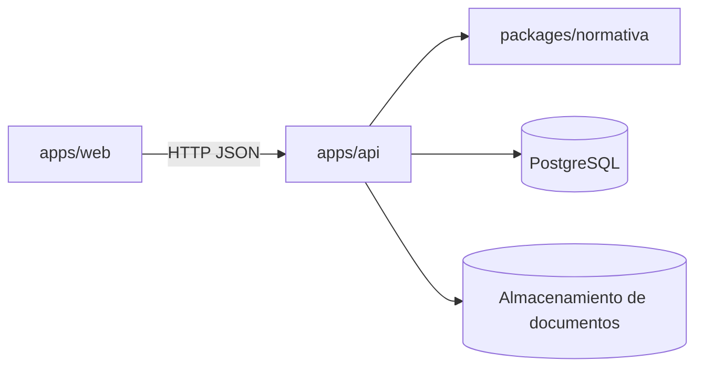
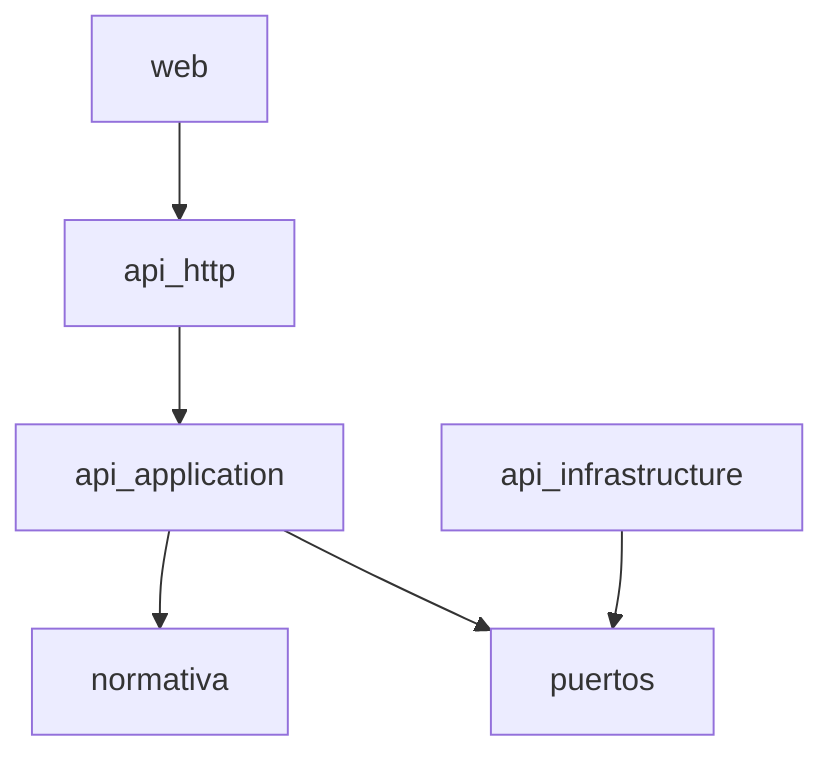
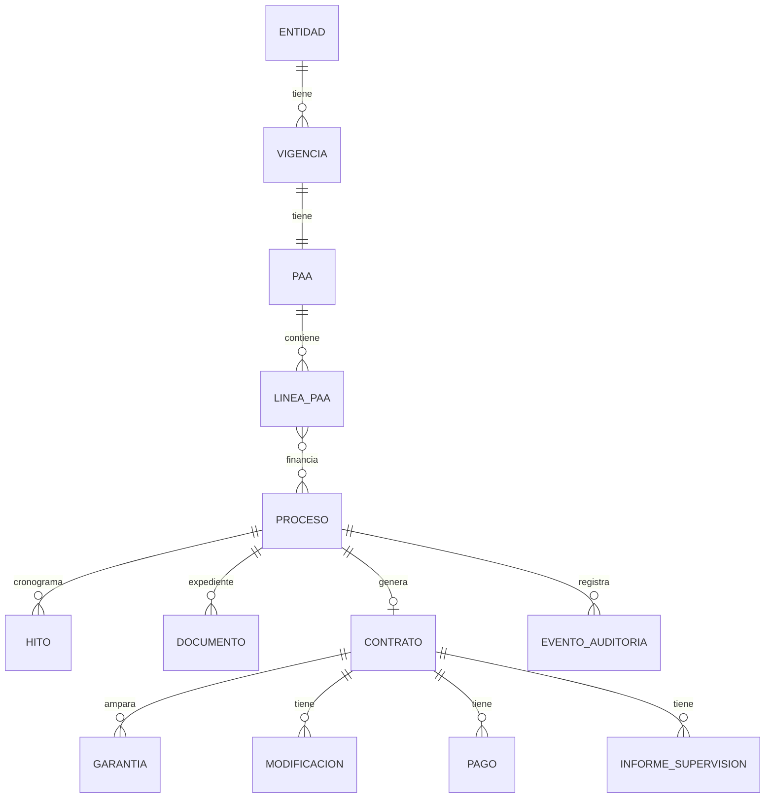

# Architecture Spine — SICOP

## Design Paradigm

Hexagonal. El dominio legal vive en un paquete puro sin dependencias de infraestructura; la API orquesta casos de uso y adapta persistencia, archivos y notificaciones.

| Capa | Ubicación | Responsabilidad |
| --- | --- | --- |
| Motor Normativo (dominio puro) | `packages/normativa` | Festivos, días hábiles, cuantías, modalidades, cronogramas, garantías, modificaciones, liquidación. Sin I/O. |
| Aplicación | `apps/api/src/modules/*/application` | Casos de uso, autorización, transacciones. |
| Adaptadores | `apps/api/src/modules/*/infrastructure` | Prisma/PostgreSQL, almacenamiento de archivos, correo. |
| Interfaz | `apps/api/src/modules/*/http`, `apps/web` | REST + UI web. |



## Invariants & Rules

### AD-1 — El Motor Normativo es puro
- **Binds:** FR-2, FR-4, FR-5, FR-8..FR-11, FR-22, FR-27, FR-28
- **Prevents:** reglas legales dispersas en controladores, consultas SQL o UI.
- **Rule:** `packages/normativa` no importa nada de `apps/*`, no hace I/O, no lee el reloj del sistema (la fecha "hoy" entra como parámetro) y no tiene dependencias de runtime.

### AD-2 — Parámetros anuales son datos, no constantes
- **Binds:** FR-1, FR-2, FR-3
- **Prevents:** recompilar para cambiar el SMMLV o umbrales.
- **Rule:** SMMLV, Presupuesto Anual, umbral Mipyme y calendario electoral entran como argumentos al motor. El paquete puede exportar una tabla de SMMLV de referencia, pero la API usa la tabla persistida.

### AD-3 — Dinero en enteros
- **Binds:** NFR-2, todos los cálculos monetarios
- **Prevents:** errores de punto flotante en topes legales.
- **Rule:** valores en pesos colombianos como `bigint` en el motor y `BIGINT` en la base de datos. Las conversiones a SMMLV se hacen comparando productos enteros (`valor * 100 <= tope * smmlv * 100`), nunca dividiendo con flotantes.

### AD-4 — Fechas legales son fechas civiles
- **Binds:** FR-8..FR-11, FR-28, NFR-8
- **Prevents:** desfases por zona horaria al calcular días hábiles.
- **Rule:** el motor trabaja con `FechaCivil` (`YYYY-MM-DD`, sin hora). La conversión desde instantes se hace en el borde con zona `America/Bogota`.

### AD-5 — Toda decisión del motor es citable y versionada
- **Binds:** FR-4, FR-5, FR-6, NFR-3
- **Prevents:** recomendaciones sin sustento jurídico o no reproducibles.
- **Rule:** cada resultado incluye `fundamentos: Fundamento[]` (norma + artículo) y `versionReglas`. La API persiste entradas, salida y versión.

### AD-6 — Bitácora append-only
- **Binds:** FR-31
- **Rule:** la tabla de eventos de auditoría solo admite `INSERT`; el rol de base de datos de la aplicación no tiene `UPDATE/DELETE` sobre ella.

### AD-7 — Dirección de dependencias



## Consistency Conventions

| Concern | Convention |
| --- | --- |
| Idioma del dominio | Español en nombres de dominio (`Modalidad`, `calcularMenorCuantia`); inglés solo en términos técnicos genéricos. |
| Naming archivos | `kebab-case.ts`; pruebas junto al código como `*.test.ts`. |
| Identificadores | UUID v7 en la API. |
| Fechas | `FechaCivil` = string `YYYY-MM-DD` en el motor y en JSON. |
| Errores | El motor devuelve resultados con `advertencias`/`violaciones`; lanza `ErrorNormativo` solo por entradas inválidas. API: RFC 9457 (problem+json). |
| Citas legales | `{ norma: 'Ley 1150 de 2007', articulo: '2 num. 2 lit. b' }`. |
| Pruebas | Vitest; cada umbral legal con pruebas de frontera (igual, −1, +1). |

## Stack

| Name | Version |
| --- | --- |
| Node.js | 22 LTS |
| TypeScript | 5.9 (fijado por compatibilidad del ecosistema; evaluar 7.x en Épica 2) |
| Vitest | 3.x |
| npm workspaces | 10.x |
| NestJS | 11+ (Épica 2) |
| Prisma + PostgreSQL | Prisma estable vigente + PostgreSQL 16 (Épica 2) |
| Next.js + React | 16 / 19 (Épica 6) |

## Structural Seed

```text
/
  packages/normativa/      # Motor Normativo puro (Épica 1)
    src/calendario/        # festivos, días hábiles
    src/cuantias/          # SMMLV, menor/mínima cuantía
    src/modalidades/       # recomendación de modalidad
    src/cronogramas/       # hitos por modalidad
  apps/api/                # NestJS (Épica 2+)
  apps/web/                # Next.js (Épica 6)
  _bmad/                   # BMAD method (no editar a mano)
  _bmad-output/            # artefactos de planeación e implementación
```



## Capability → Architecture Map

| Capability / Area | Lives in | Governed by |
| --- | --- | --- |
| FR-1..FR-3 Parámetros | `normativa/cuantias` + `api/modules/parametros` | AD-2, AD-3 |
| FR-4..FR-7 Modalidad | `normativa/modalidades` + `api/modules/procesos` | AD-1, AD-5 |
| FR-8..FR-11 Calendario/Cronograma | `normativa/calendario`, `normativa/cronogramas` | AD-1, AD-4 |
| FR-12..FR-20 PAA y Procesos | `api/modules/paa`, `api/modules/procesos` | AD-7 |
| FR-21..FR-29 Contratos | `api/modules/contratos` + `normativa/garantias`, `normativa/ejecucion` | AD-1, AD-3 |
| FR-30..FR-33 Expediente/seguridad | `api/modules/expediente`, `api/modules/auth` | AD-6 |
| FR-34..FR-36 Alertas/datos | `api/modules/alertas`, `api/modules/exportacion` | AD-2 |

## Deferred

- Proveedor de nube y despliegue (pregunta abierta 2 del PRD) — se decide antes de la Épica 2.
- Almacenamiento de documentos (S3 compatible vs. disco) — Épica 5.
- Motor de flujos (máquina de estados propia vs. librería) — Épica 3.
- Multientidad — v2.
